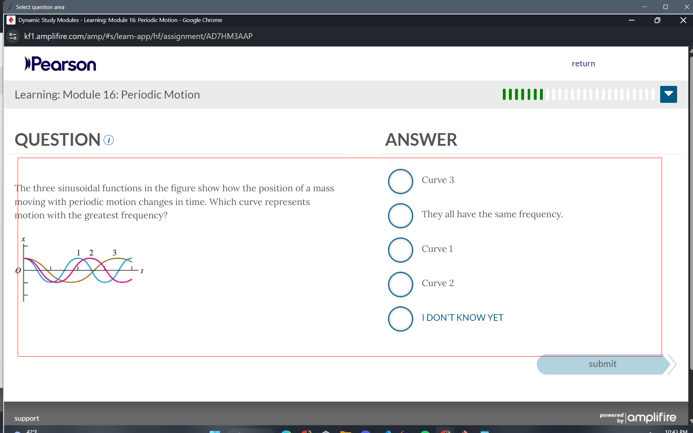
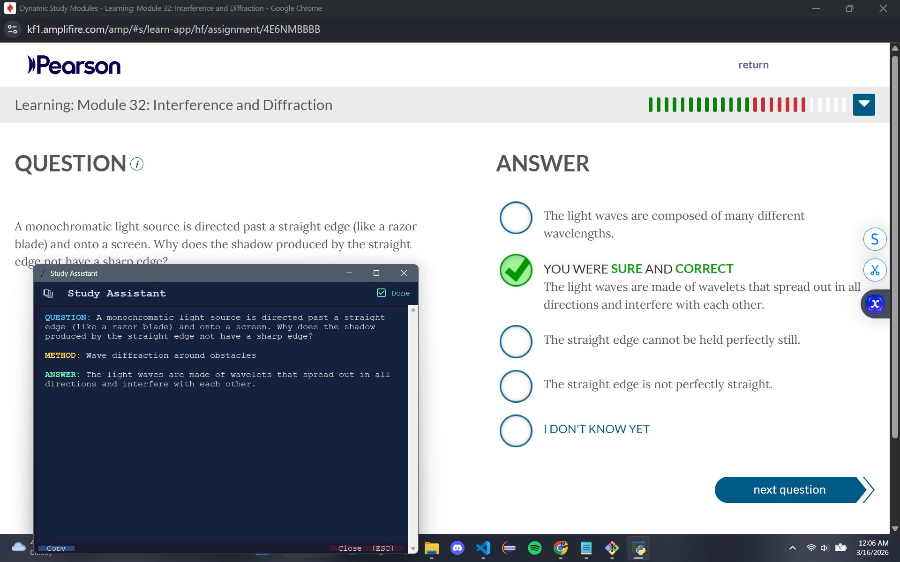

# 📚 Vision Study Assistant

A hotkey-activated desktop tool that lets you capture any question on your screen and get an instant AI-powered answer — without switching windows or copy-pasting anything.

Press **CTRL+SHIFT+S**, drag a box around a question, and Claude streams a formatted answer directly on top of your screen in real time.


## Demo

**Step 1 — Select the question region:**


**Step 2 — Answer streams instantly:**

<!-- Replace with an actual screenshot of your result window -->

---

## Features

- **Hotkey-activated** — works from any window, any application
- **Region selection** — drag to select exactly the question you want solved
- **Live streaming** — answers appear token-by-token as Claude generates them
- **Color-coded output** — QUESTION (blue), METHOD (amber), ANSWER (green)
- **Copy to clipboard** — one click to copy the full response
- **Stays on top** — result window floats above all other windows

---

## Demo

```
Press CTRL+SHIFT+S
→ Drag box around question
→ Answer streams in ~1 second:

QUESTION: Find the derivative of x²sin(x)
METHOD:   Product rule
ANSWER:   2x·sin(x) + x²·cos(x)
```

---

## Tech Stack

| Layer | Technology |
|-------|-----------|
| Language | Python 3.9+ |
| AI Model | Claude Sonnet (`claude-sonnet-4-20250514`) |
| Screenshot | `mss` |
| Image Processing | `Pillow` |
| GUI | `Tkinter` (built into Python) |
| Hotkey Listener | `keyboard` |
| API | Anthropic Messages API (streaming) |

---

## How It Works

```
CTRL+SHIFT+S pressed
       ↓
Background thread spawned (prevents GUI freeze)
       ↓
Full monitor screenshot taken (mss)
       ↓
Region Selector opens — user drags rectangle
       ↓
Image cropped to selection + resized (LANCZOS, max 1120px)
       ↓
Image base64-encoded → sent to Claude API (streaming)
       ↓
Result Window fills live as tokens arrive
Color-coding applied per line (QUESTION / METHOD / ANSWER)
```

---

## Installation

**1. Clone the repo**
```bash
git clone https://github.com/YOUR_USERNAME/vision-study-assistant.git
cd vision-study-assistant
```

**2. Install dependencies**
```bash
pip install anthropic mss pillow keyboard
```

**3. Set your Anthropic API key**

Get a free API key at [console.anthropic.com](https://console.anthropic.com)

Option A — environment variable (recommended):
```bash
# Windows
set ANTHROPIC_API_KEY=your_key_here

# macOS/Linux
export ANTHROPIC_API_KEY=your_key_here
```

Option B — hardcode it in the script (never commit this):
```python
client = anthropic.Anthropic(api_key="your_key_here")
```

**4. Run**
```bash
python study_assistant.py
```

---

## Usage

| Action | How |
|--------|-----|
| Activate | Press `CTRL+SHIFT+S` from any window |
| Select question | Click and drag a rectangle around the question |
| Cancel selection | Press `ESC` in the region selector |
| Copy answer | Click the **Copy** button |
| Close result | Press `ESC` or click **Close** |
| Quit program | Press `ESC` in the terminal |

> **Tip:** Include any context boxes or given values in your selection — if the problem has a setup paragraph on the left, drag wide enough to capture it.

---

## Project Structure

```
vision-study-assistant/
├── study_assistant.py   # main script
├── .gitignore
├── README.md
└── captures/            # auto-created, gitignored
    ├── full_*.png       # full monitor screenshots
    ├── crop_*.png       # your selected region
    └── crop_*_sm.png    # resized version sent to API
```

---

## Configuration

All tunable constants are at the top of `study_assistant.py`:

```python
CAPTURE_HOTKEY   = "ctrl+shift+s"   # change hotkey here
MODEL            = "claude-sonnet-4-20250514"
MAX_THUMB_SIZE   = (1120, 1120)     # increase for denser text
MAX_TOKENS       = 300              # increase for longer answers
```

---

## Customization

**Change the output format** — edit the `PROMPT` variable:
```python
PROMPT = """
Solve every question in the screenshot.
QUESTION: <question>
METHOD: <3-5 words>
ANSWER: <final answer only>
"""
```

**Add a subject hint** for better accuracy on specific topics:
```python
PROMPT = """
You are a precise Differential Equations tutor.
Solve every question using ODE techniques...
"""
```

---

## Requirements

- Python 3.9+
- Windows or Linux (macOS requires accessibility permissions for `keyboard`)
- Anthropic API key ([free tier available](https://console.anthropic.com))

```
anthropic
mss
pillow
keyboard
```

---

## Known Limitations

- Only captures the primary monitor (`mss.monitors[1]`)
- Superscripts and subscripts in images may be misread (e.g. `10⁻⁶` → `10-6`)
- `keyboard` library requires administrator/root privileges on some systems
- macOS users need to grant accessibility permissions in System Preferences

---

## Future Ideas

- [ ] Subject selector (Math / Physics / CS) for better prompt context
- [ ] Correction system — mark wrong answers and fine-tune future prompts
- [ ] History log of all past Q&A sessions
- [ ] Two-pass pipeline: OCR extraction → separate solve call for higher accuracy
- [ ] Confidence indicator per answer

---

## License

MIT — do whatever you want with it.

---

*Built with the [Anthropic API](https://anthropic.com) and Python.*
